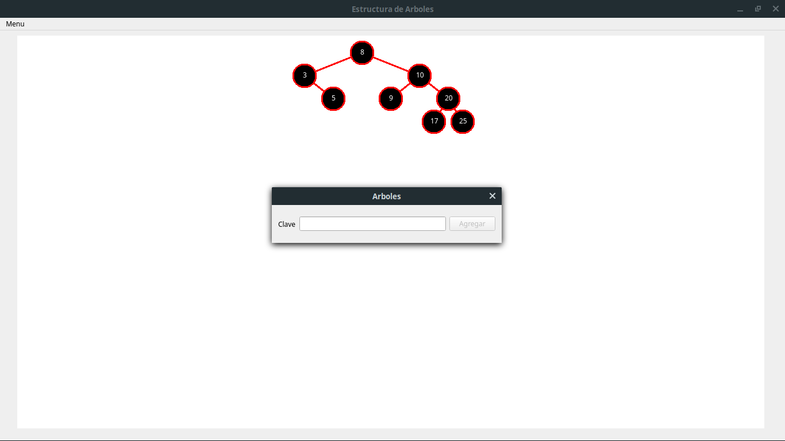

## **Estructura de Arboles**
Autor: Erick Saravia  
Ultima modificacion: 27 / 11 / 2019  
correo: ericksaravia16@gmail.com  
version: 1.0.0
***
> ## **Finalidad**
> Aplicacion que permita gestionar las operaciones con arboles (estructuras de datos). la aplicacion debe permitir las siguientes opciones:
> - Arbol de expresion
>   - crear
>   - mostrar
> - Arbol Binario
>   - insertar nodo
>   - mostrar
>       - pre-orden
>       - in-orden
>       - post-orden
>       - guardar en un archivo de texto       
>   - buscar nodo
>   - eliminar nodo
> - Arbol AVL (Balamceado)
>   - insertar nodo
>   - mostrar
>       - pre-orden
>       - in-orden
>       - post-orden
>       - guardar en un archivo de texto       
>   - buscar nodo
>   - eliminar nodo
> - Salir   

## Descripcion
***
Aplicacion que muestra en un ambiente grafico y compresible el comportamiento de los tres tipos de arboles mencionados anteriormente

## **Herramientas** 
***
- **IDE:** 
    - Qt Creator 
- **Lenguajes utilizados**
    - C++
- **Linux Mint**
- **Qt Installer Framework**

> Instalador disponible para windows [instalador](instalador/installer.exe)

> ## **Detalle**
> ---
> Existen 2 clases de las cuales heredan los arboles, ¿por que 2?, pues debido al tipo de datos que manejan y por problemas en la impresion al heredar de uno solo, debido a que los arboles binarios y AVL, son muy diferentes a un arbol de expresion 

## **Capturas de pantalla**
---
## Arbol de expresion: (2/(2*99))+((54^12)+7)

## Arbol Binario - claves insertadas: 1, 15, 2, 56

## Arbol AVL - claves insertadas: 3, 8, 10, 5, 9, 17, 20, 25
