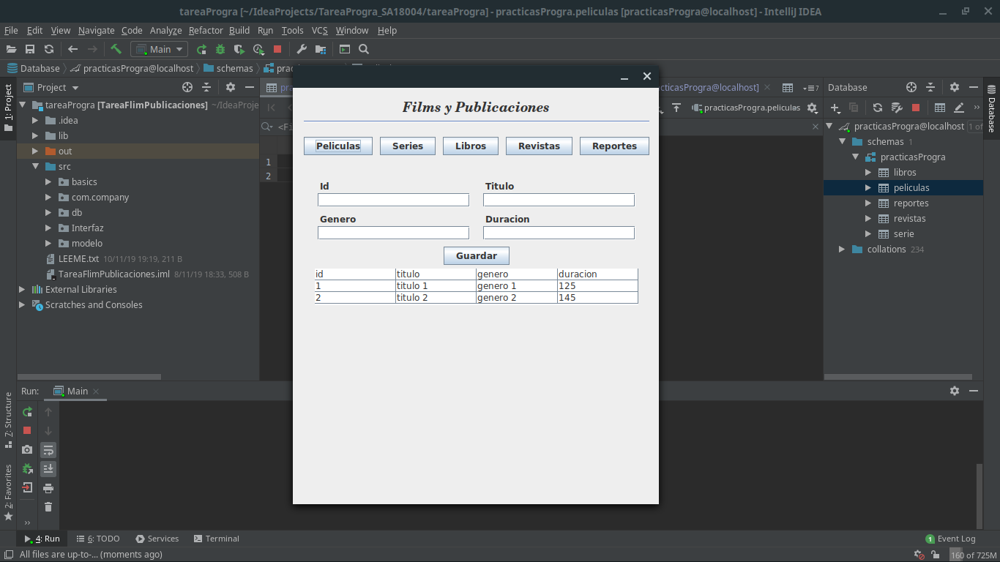

## **Films y Publicaciones**
Autor: Erick Saravia  
Ultima modificacion: 24 / 11 / 2019  
correo: ericksaravia16@gmail.com  
version: 1.0.0
- - -

> ## **Finalidad**
> Crear una aplicaion que permita agregar registros en la base de datos proporcionada, mostrando todos los cambios en pantalla

## Descripcion
---
La aplicacion gestiona las 5 tablas con la que cuenta la base de datos proporcionada, contando con un menu que permite al usuario seleccionar con cual tabla desea trabajar, el cual muestra la vista correspondiente a la opcion seleccionada

## **Herramientas** 
---
- **IDE:** 
    - IntelliJ IDEA Ultimate 2019.2
- **Gestor de base de datos:** 
    - MariaDB 
- **Lenguajes utilizados**
    - Java
    - SQL
- **JDK:** OpeJDK 11.0.2
- **Linux Mint**

## **Estructura del proyecto**
---
### **Paquetes:**
- **Basics:** Clases para realizaroperaciones basicas
- **com.company:** Paquete creado por defecto por el IDE
- **db:** Se maneja todo lo relacionado con las conexiones con la base de datos
- **modelo:** Modelos utilizados 
- **Interfaz:** Contine todos los componentes graficos que se dividen en dos archivos por cada vista
    - **vista.java:** contiene la logica de la vista
    - **vista.form:** formulario que se trabaja de forma grafica

## **Captura de pantalla**
~~~
Para todas las vistas se usa una estructura similar: formulario de ingreso de datos, boton de guardado, tabla que muestra los registros en la base de datos 
~~~

## **Notas**
---
- Segun el requerimiento se solicitaba que la clave primaria fuera ingresada manualmente y no autogenerada
