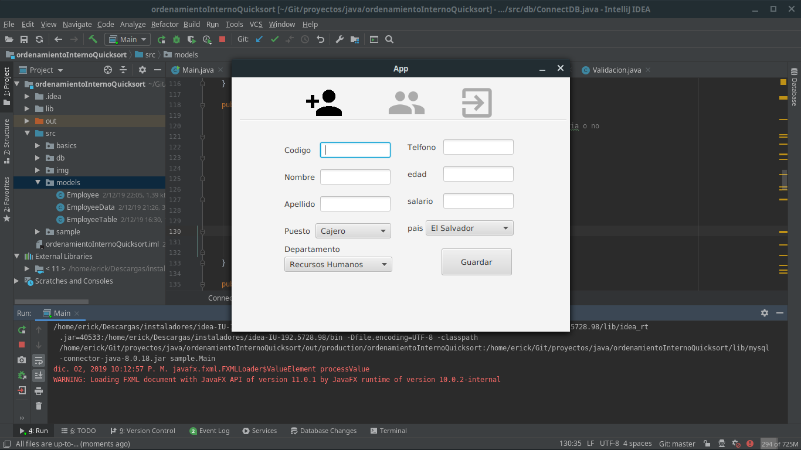
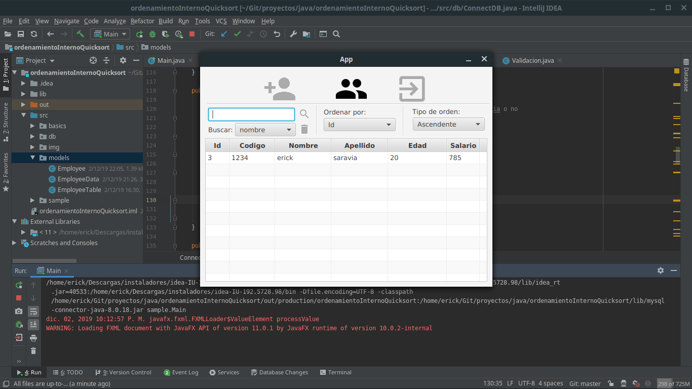

# **Ordenamiento interno**

Autor: Erick Saravia  
Ultima modificacion: 02 / 12 / 2019  
correo: ericksaravia16@gmail.com
version: 1.0.0
***
> ## **Requerimientos**
> La aplicacion debe permitir ingresar nuevos empleados a la base de datos planteada, permitir buscar empleados por su nombre y apellido, y ordenearlos de forma ascendente y descendente en base a los campos de id, sueldo, y edad

***
## **Herramientas** 
- **IDE:** 
    - IntelliJ IDEA Ultimate 2019.2
    - Scene Builder
- **Gestor de base de datos:**
    - MariaDB
- **Lenguajes utilizados**
    - JavaFX
    - SQL
- **JDK:** OpeJDK 11.0.2
- **Conexion.java:** Clase para interactuar con bases de datos con java(proyecto propio) [leer mas](https://github.com/erickjosue8916/proyectos/edit/master/java/GestionDB/README.md)
- **Linux Mint**
---
## **Estructura del proyecto**
---
### **Paquetes:**
- **Basics:** Clases para realizar operaciones basicas
- **db:** Se maneja todo lo relacionado con las conexiones con la base de datos
- **img:** Contiene los iconos que se utilizan en la aplicacion
- **models:** Modelos utilizados 
    - **Empleado:** Modelo para la entidad del empleado 
    - **Tabla empleado:**  Modelo empleado en la tabla de empleados (necesario segun la estructura que sigue su uso)
    - **Datos empleado:** Gestiona las operaciones que se realizaran con un empleado (metodos estaticos relacionados al este tipo datos como la ordenacion)
- **Sample:** contiene lo relacionado a la vista del proyecto y la clase principal
    - **Controller.java**: maneja la funciales de la aplicacion
    - **Main.java:** clase principal que inicia la ejecucion
    - **principal.fxml:** contiene la vista de la aplicacion en un lenguaje de marcado

> configura la base de datos con la que se trabajara en el archivo ***Main.java linea 14*** segun se especifica en [Conexion.java](https://github.com/erickjosue8916/proyectos/edit/master/java/GestionDB/README.md)

# **Caracteristicas**
- Validacion de campos en el ingreso de datos
- Las busquedas se realizan en el momento que el usuario escribe en el campo de busqueda
- El ordenamiento se hace en memoria interna, los datos una vez peticionados, no se vuelven a pedir a 
menos que se realize una accion que cree o elimine los datos 
- Para ordenar los datos se utiliza el algoritmo de ordenamiento QuickSort

# **Capturas de pantalla**
## **Registro de empleados**
 

## **Consulta de empleados**

