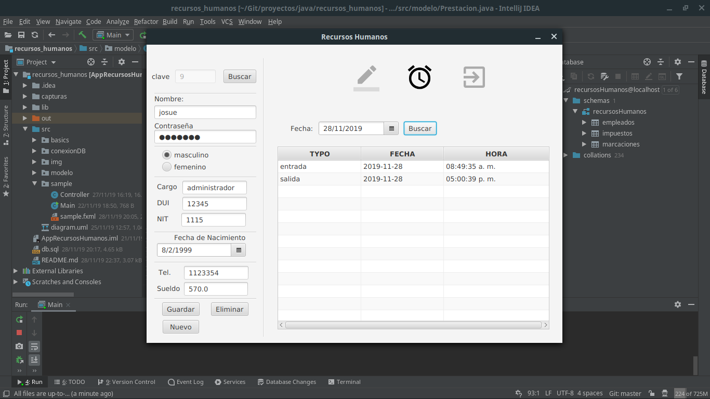

# **APP RECURSOS HUMANOS**

Autor: Erick Saravia  
Ultima modificacion: 22 / 11 / 2019  
correo: ericksaravia16@gmail.com
version: 1.0.0
***
> ## **Requerimientos**
> La aplicacion debe permitir gestionar los datos de los empleados, permitir calcular las prestaciones de ley, para los empleados, asi como gestionar las marcaciones de entrada y salida 
## **Descripción**
Aplicacion que permite realizar la gestion de empleados para recursos humanos, que cuenta con tres vistas principales: 

- **Login:** Un usuario puede hacer su ingreso como administrador o como empleado
- **Vista Administrador:** Se permite agregar un nuevo empleado, listar los empleados registrados calculando sus prestaciones de ley y su registro de marcaciones de entrada y salida; tambien se permite eliminar el registro  de un empleado
- **Vista empleado:** Solo se le permite realizar sus marcaciones, validadndo que solo pueda realizar un entrada y salida por dia, sin oportunidad de trucar la hora de marcacion

***
## **Herramientas** 
- **IDE:** 
    - IntelliJ IDEA Ultimate 2019.2
    - Scene Builder
- **Gestor de base de datos:**
    -   MariaDB
- **Lenguajes utilizados**
    - JavaFX
    - SQL
- **JDK:** OpeJDK 11.0.2
- **Conexion.java:** Clase para interactuar con bases de datos con java(proyecto propio) [leer mas](https://github.com/erickjosue8916/proyectos/edit/master/java/GestionDB/README.md)
- **Linux Mint**
***
## **Estructura del proyecto**
***
### **Paquetes:**
- **Basics:** Clases para realizaroperaciones basicas
- **com.company:** Paquete creado por defecto por el IDE
- **ConexionDB:** Se maneja todo lo relacionado con las conexiones con la base de datos
- **img:** Contiene los iconos que se utilizan en la aplicacion
- **modelo:** Modelos utilizados 
    - **Vista (tablas en pantalla):** solo tienen el nombre de la entidad
    - **Datos (tablas en la Base de datos):**  precede al nombre de la clase el prefijo"Modelo"
- **Sample:** contiene lo relacionado a la vista del proyecto y la clase principal
    - **Controller.java**: maneja la funciales de la aplicacion
    - **Main.java:** clase principal que inicia la ejecucion
    - **principal.fxml:** contiene la vista de la aplicacion en un lenguaje de marcado

> configura la base de datos con la que se trabajara en el archivo ***Main.java linea 14*** segun se especifica en [Conexion.java](https://github.com/erickjosue8916/proyectos/edit/master/java/GestionDB/README.md)

> ## NOTA
> Los datos de los impuestos fueron insertados en una tabla de la base de datos, en caso que se requiera hacer un cambio editar dicha tabla

# **Capturas de pantalla**
## **Login**
 **Administrador:** 
 - usuario: Admin
 - contraseña: Admin
    
  **Empleado**: 
 - usuario: su id en la base de datos
 - contraseña: contraseña asignada segun su registro

## **Vista de Administrador**

- ## Vista de Administrador - vista 1

    
- ## Vista de Administrador - vista 2

## Vista de empleado 

